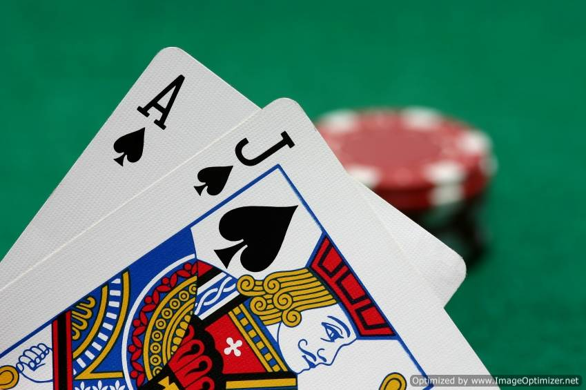

# Monte-Carlo-Blackjack-Sim

Monte Carlo type of simulation which outputs your % chance of winning given: 1) what the dealer is showing and 2) your first two cards and a strategy similar to the dealers. I used this to quickly determine my probability of winning each hand, so that I could create a strategy of when to split, hit, stay etc. But I found that the house always wins! The house wins because they win in the case where both player and dealer bust, and there is a high probability of that happening. 
